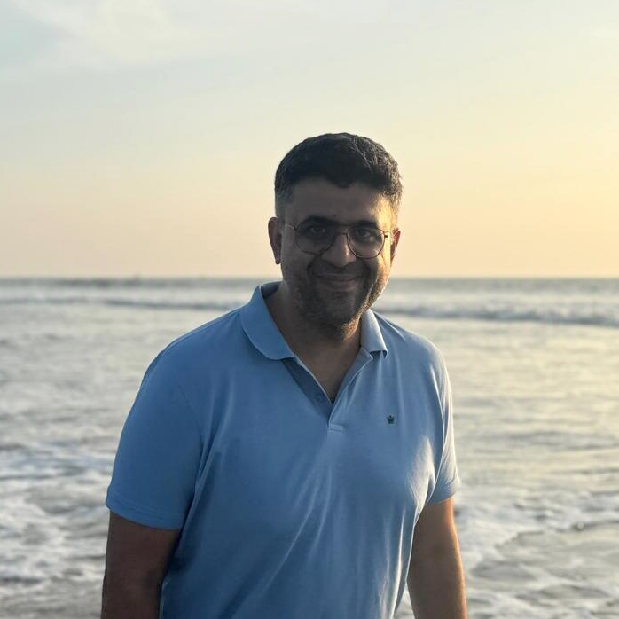

<head>
  <link href="https://cdnjs.cloudflare.com/ajax/libs/font-awesome/6.0.0/css/all.min.css" rel="stylesheet">
</head>

  

    <!-- Department Information -->
    

      Dept of Computer Science and Automation 
      Indian Institute of Science 
      and 
      National Instruments R&D
    

    
    <!-- Social Media Links -->
    

      <a href="https://www.linkedin.com/in/ashwin-prasad-2b0589160/" target="_blank" style="margin-right: 10px; font-size: 16px;">
        <i class="fab fa-linkedin" style="font-size: 20px; color: #0A66C2;"></i> LinkedIn
      </a>
      <a href="https://github.com/asprasad" target="_blank" style="margin-right: 10px; font-size: 16px;">
        <i class="fab fa-github" style="font-size: 20px; color: white;"></i> GitHub
      </a>
      <a href="https://scholar.google.com/citations?user=DUN8zu0AAAAJ&hl=en" target="_blank" style="margin-right: 10px; font-size: 16px;">
        <i class="fas fa-user-graduate" style="font-size: 20px;"></i> Google Scholar
      </a>
    

    
    <!-- Email -->
    

      <i class="fas fa-envelope" style="font-size: 20px; color: white; margin-right: 5px;"></i>
      [first name].[last name]@gmail.com
    

  

  <!-- Image -->
  

    
  

I am a computer systems researcher interested in designing and implementing efficient and high-performance computer systems.
My time is split between research as a PhD candidate in the <a href="https://www.csa.iisc.ac.in/" target="_blank"> Department of Computer Science and Automation</a> at the <a href="https://iisc.ac.in/">Indian
Institute of Science</a>, Bangalore and industrial research and development through my role as a Chief Engineer at <a href="https://www.ni.com/">National Instruments R&D</a>, Bangalore. At IISc, I am advised by <a href="https://www.csa.iisc.ac.in/~govind/">Prof. R Govindarajan</a> and <a href="https://www.csa.iisc.ac.in/~udayb/">Prof. Uday Bondhugula</a>. 

In particular, I am interested in designing systems that enable high-productivity and portable performance through domain-specific compilers, programming models, and runtimes that provide portable performance across targets like CPUs, GPUs and FPGAs. My current research focuses on the design of optimizing compilers and code generators for the domains of machine learning and data science.

## Research

## Publications

SilvanForge: A Schedule Guided Retargetable Compiler for Decision Tree Inference 
Ashwin Prasad, Sampath Rajendra, Kaushik Rajan, R Govindarajan, Uday Bondhugula 
ACM SIGOPS 30th Symposium on Operating Systems Principles (SOSP 2024) 
<a class="badge badge-success" style="color:white ; margin-right: 5px;" href="papers/SilvanForge-SOSP24.pdf" target="_blank"><i class="fas fa-file-pdf" style="color:white;"></i> Paper</a> 
<a class="badge badge-primary" style="color:white ;  margin-right: 5px;" href="https://github.com/asprasad/treebeard" target="_blank"><i class="fas fa-file-code" style="color:white;"></i> Code</a>

  

Treebeard: An Optimizing Compiler for Decision Tree Based ML Inference 
Ashwin Prasad, Sampath Rajendra, Kaushik Rajan, R Govindarajan, Uday Bondhugula 
 55th IEEE/ACM International Symposium on Microarchitecture (MICRO 2022) 
<a class="badge badge-success" style="color:white ; margin-right: 5px;" href="papers/Treebeard-MICRO22.pdf" target="_blank"><i class="fas fa-file-pdf" style="color:white;"></i> Paper</a> 
<a class="badge badge-primary" style="color:white ;  margin-right: 5px;" href="https://github.com/asprasad/treebeard" target="_blank"><i class="fas fa-file-code" style="color:white;"></i> Code</a>

  

Incremental Diagram Layout for Automated Model Migration 
Ulf Ruegg, Rajneesh Lakkundi,
Ashwin Prasad, Anand Kodaganur, Christoph Daniel Schulze, Reinhard von Hanxleden 
ACM/IEEE International Conference on Model Driven Engineering Languages and Systems (MoDELS 2016) 
<a class="badge badge-success" style="color:white ; margin-right: 5px;" href="papers/IncrementalLayout-MODELS16.pdf" target="_blank"><i class="fas fa-file-pdf" style="color:white;"></i> Paper</a> 
